# ATLAS — Analyst Threat & Link Analysis System

> A self-hosted, localhost CTI workbench that ingests raw threat data, enriches it via live API calls across six sources, and correlates everything — IOCs, actors, campaigns, incidents, and vulnerabilities — into a single queryable knowledge base and force-directed graph.

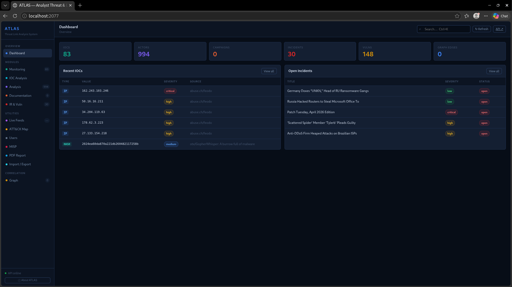

---

## What is ATLAS?

ATLAS is built for security analysts who need one local framework to **collect**, **enrich**, **correlate**, and **act on** threat intelligence — without sending your data to a third-party platform.

It runs entirely on `localhost:2077`. Everything stays on your machine.

---

## Screenshots

| Dashboard | Monitoring |
|---|---|
|  | 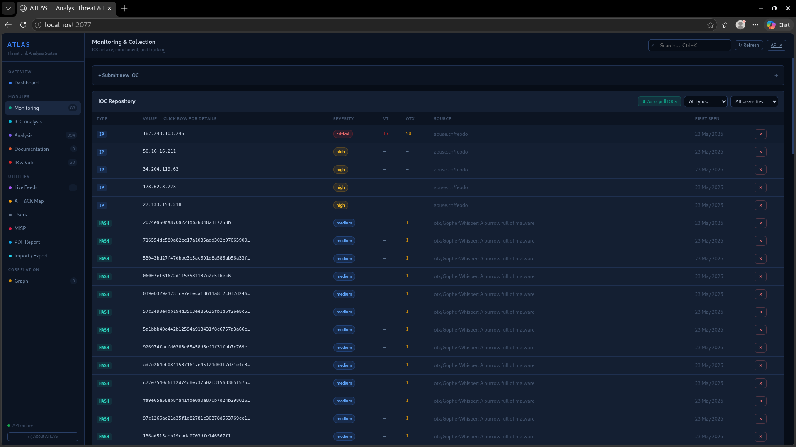 |

| IOC Analysis | Threat Actors |
|---|---|
| 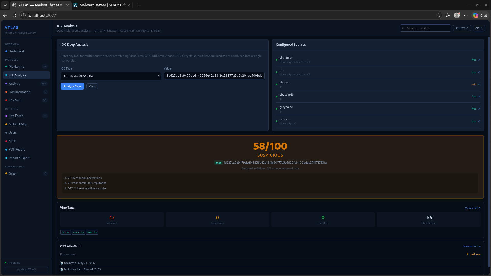 | 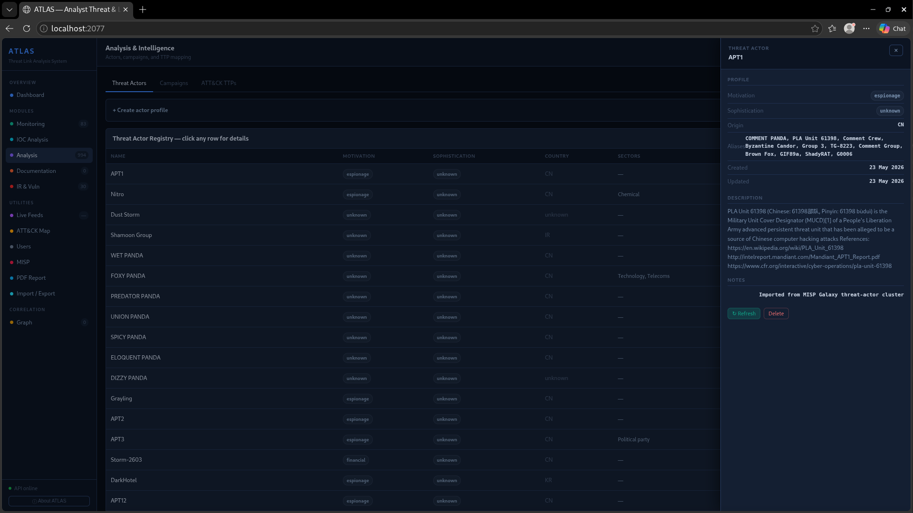 |

| IR & Vulnerability Management | Live Feeds |
|---|---|
| 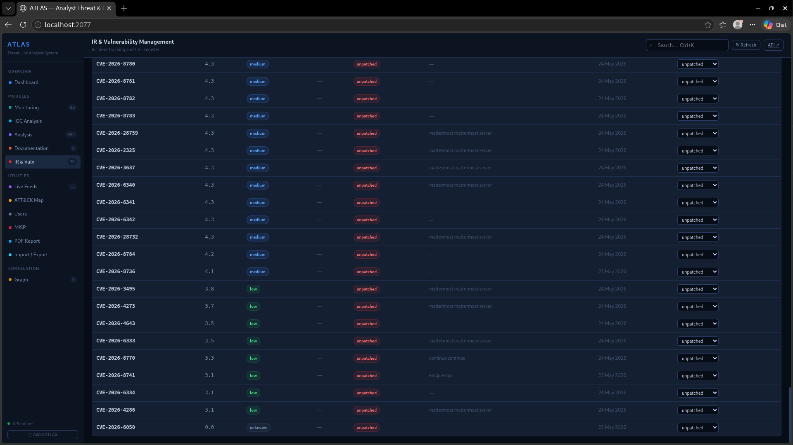 | 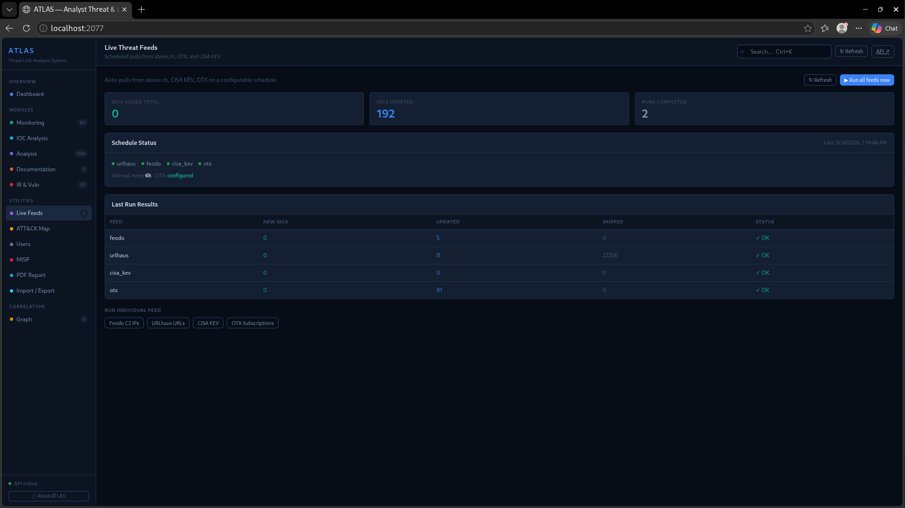 |

| ATT&CK Navigator Map | PDF Report Generator |
|---|---|
| 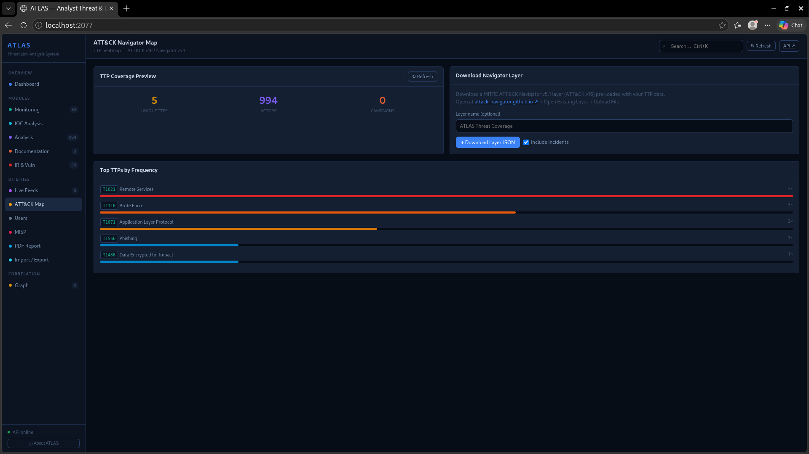 | 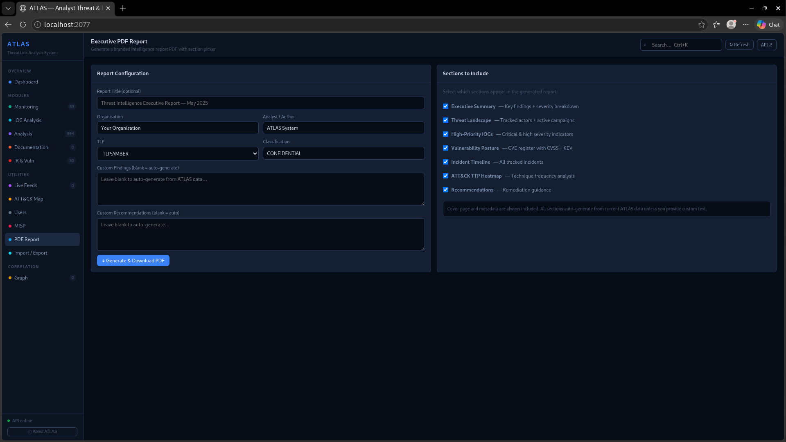 |

| Correlation Graph | Import / Export |
|---|---|
| 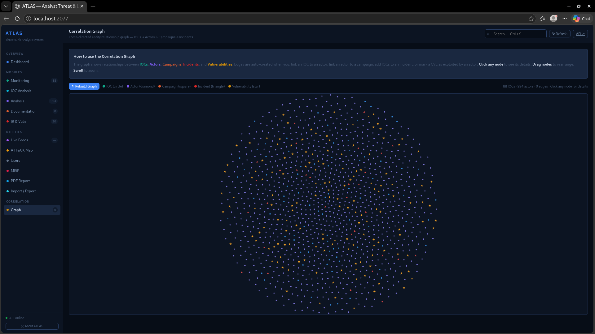 | 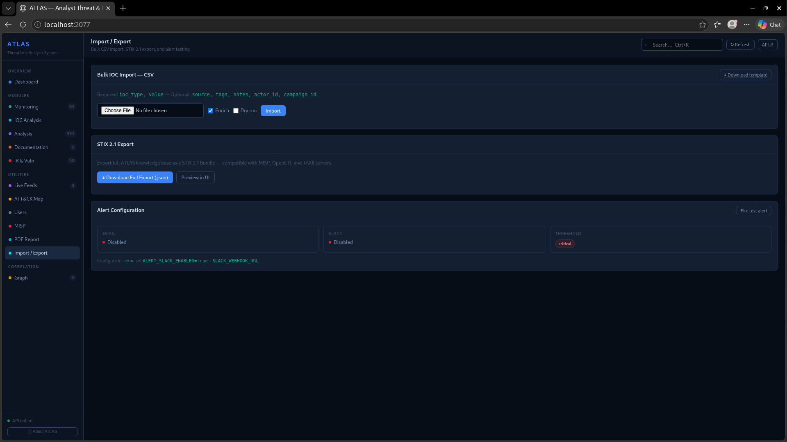 |

| About |
|---|
| 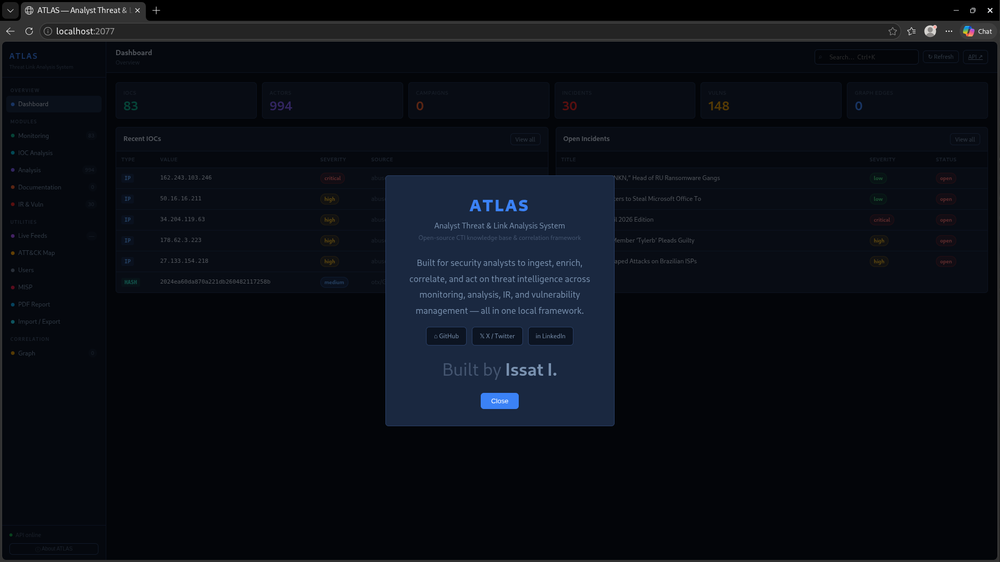 |

---

## Features

### Modules
- **Monitoring & Collection** — Submit IOCs (domain, IP, hash, URL, email), auto-enriched via VirusTotal + OTX + Shodan. Click any row for a full enrichment detail panel.
- **IOC Analysis** — Deep multi-source analysis combining VirusTotal, OTX AlienVault, AbuseIPDB, GreyNoise, URLScan.io, and Shodan into a single 0–100 risk verdict.
- **Analysis** — Threat actor registry with ATT&CK TTP mapping. One-click import of 700+ actors from MISP Galaxy. Campaign tracker with full correlation to IOCs.
- **Documentation** — TLP-classified intelligence report builder (daily, weekly, flash alerts, actor profiles, executive summaries).
- **IR & Vulnerability Management** — Incident tracker with timeline and status workflow. CVE register with auto CISA KEV check. Click any CVE for full NVD detail panel.

### Utilities
- **Live Feeds** — Scheduled auto-pull from abuse.ch Feodo Tracker, URLhaus, CISA KEV, and OTX subscriptions (configurable interval, no API key needed for most).
- **ATT&CK Navigator Map** — Generates a MITRE ATT&CK v16 / Navigator v5.1 layer JSON from all actor and campaign TTPs. Download and open at attack-navigator.github.io instantly.
- **MISP Integration** — Bi-directional: push ATLAS IOCs to MISP events, pull MISP attributes as ATLAS IOCs.
- **PDF Report Generator** — Branded, multi-section executive PDF with section picker, TLP marking, auto-generated findings and recommendations.
- **Import / Export** — Bulk CSV IOC import with enrichment, STIX 2.1 bundle export, Slack/email alerting for critical IOCs.
- **Correlation Graph** — Force-directed graph showing all entity relationships. Nodes are IOCs, actors, campaigns, incidents, and vulnerabilities. Edges auto-build as you link data together.

---

## Quick Start

```bash
# 1. Clone / extract
cd atlas

# 2. Virtual environment
python -m venv venv
source venv/bin/activate        # Windows: venv\Scripts\activate

# 3. Install dependencies
pip install -r requirements.txt

# 4. Configure
cp .env.example .env
# Add your API keys (VT, OTX, etc.) — see API Keys section below

# 5. Fix graph library (one-time)
curl -L https://cdnjs.cloudflare.com/ajax/libs/vis-network/10.0.2/standalone/umd/vis-network.min.js \
     -o static/vis-network.min.js

# 6. Run
python main.py
```

Open **http://localhost:2077**

- Interactive API docs: **http://localhost:2077/docs**
- Health check: **http://localhost:2077/api/health**

---

## API Keys

| Service | Get it at | Free tier | Used for |
|---|---|---|---|
| VirusTotal | virustotal.com/gui/join-us | 4 lookups/min | IOC enrichment + Analysis |
| OTX AlienVault | otx.alienvault.com | Unlimited | IOC enrichment + feeds |
| Shodan | account.shodan.io | Limited | Port/banner data on IPs |
| AbuseIPDB | abuseipdb.com | 1000/day | IP abuse confidence score |
| GreyNoise | greynoise.io | Community tier | Internet scanner classification |
| URLScan | urlscan.io | 100 scans/day | URL/domain page analysis |
| CISA KEV | Public feed | No key needed | Known exploited CVEs |
| abuse.ch feeds | Public | No key needed | C2 IPs, malicious URLs |

---

## Configuration

```env
# .env
VIRUSTOTAL_API_KEY=your_key
OTX_API_KEY=your_key
SHODAN_API_KEY=your_key
ABUSEIPDB_API_KEY=your_key
GREYNOISE_API_KEY=your_key
URLSCAN_API_KEY=your_key

# MISP (optional)
MISP_URL=https://your-misp.local
MISP_KEY=your_auth_key
MISP_VERIFY_SSL=false

# Slack alerting (optional)
ALERT_SLACK_ENABLED=false
SLACK_WEBHOOK_URL=https://hooks.slack.com/services/...
ALERT_MIN_SEVERITY=critical

# Feed schedule
FEED_ENABLED=true
FEED_INTERVAL_HOURS=6
```

---

## Architecture

```
atlas/
├── main.py                    # FastAPI app, scheduler, startup
├── database.py                # SQLAlchemy async models (SQLite)
├── requirements.txt
├── .env.example
├── routers/
│   ├── monitor.py             # IOC intake + enrichment
│   ├── analysis.py            # Actors, campaigns, TTPs
│   ├── docs.py                # Reports, knowledge base
│   ├── ir.py                  # Incidents, vulnerabilities
│   ├── graph.py               # Correlation graph
│   ├── ioc_analysis.py        # Deep multi-source analysis
│   ├── feeds.py               # Live feed control
│   ├── export.py              # CSV import, STIX, alerts
│   ├── intelligence.py        # MISP, PDF, search
│   ├── autopull.py            # Bulk one-click ingestion
│   └── auth.py                # JWT auth, user management
├── services/
│   ├── enrichment.py          # VT / OTX / Shodan / CISA KEV
│   ├── ioc_analysis.py        # AbuseIPDB / GreyNoise / URLScan
│   ├── correlation.py         # Graph edge builder
│   ├── navigator.py           # ATT&CK layer generator (v16)
│   ├── feeds.py               # Feodo / URLhaus / OTX / KEV
│   ├── autopull.py            # NVD CVEs / incidents / MISP Galaxy
│   ├── misp.py                # MISP push/pull
│   ├── pdf_report.py          # ReportLab PDF generator
│   ├── stix_export.py         # STIX 2.1 bundle
│   ├── csv_import.py          # Bulk IOC CSV import
│   ├── search.py              # Global full-text search
│   └── auth.py                # JWT, bcrypt, role management
└── static/
    ├── index.html             # Single-file frontend (no build step)
    └── vis-network.min.js     # Graph library (download separately)
```

---

## API Reference

66 endpoints across 11 routers. Full interactive docs at `/docs`.

| Group | Endpoints | Description |
|---|---|---|
| `/api/monitor/` | IOC CRUD | Submit, enrich, filter, delete IOCs |
| `/api/analyze/` | Deep analysis | Multi-source IOC verdict |
| `/api/analysis/` | Actors, campaigns | Profiles, MISP Galaxy import |
| `/api/ir/` | Incidents, CVEs | Tracking, KEV check |
| `/api/graph/` | Correlation | Nodes, edges, rebuild |
| `/api/feeds/` | Live feeds | Run, schedule, status |
| `/api/navigator/` | ATT&CK | Layer download (v16) |
| `/api/export/` | Import/export | CSV, STIX, alerts |
| `/api/misp/` | MISP | Push, pull, events |
| `/api/report/pdf` | PDF | Section-picker report |
| `/api/autopull/` | Bulk ingestion | IOCs, CVEs, incidents, Galaxy |
| `/api/search` | Search | Global full-text across all entities |

---

## Graph: How Correlations Work

Edges are created automatically when you:

| Action | Edge |
|---|---|
| Link IOC to actor | `IOC → attributed_to → Actor` |
| Link IOC to campaign | `IOC → part_of → Campaign` |
| Link campaign to actor | `Campaign → conducted_by → Actor` |
| Add IOC IDs to incident | `Incident → contains → IOC` |
| CVE exploited by actor | `CVE → exploited_by → Actor` |
| Actors share 3+ TTPs | `Actor ↔ shares_ttps ↔ Actor` |

---

## Tech Stack

| Layer | Technology |
|---|---|
| Backend | Python 3.11 + FastAPI + Uvicorn |
| Database | SQLite + SQLAlchemy async |
| Frontend | Vanilla JS + HTML/CSS (no build step) |
| Graph | vis-network 10.0.2 |
| PDF | ReportLab |
| Intel formats | STIX 2.1, ATT&CK Navigator v5.1 |
| Scheduler | APScheduler |
| Auth | JWT (python-jose) + bcrypt (passlib) |

---

## Full Usage Guide

See **[ATLAS_USAGE_GUIDE.md](ATLAS_USAGE_GUIDE.md)** for the complete walkthrough covering every feature, daily workflow, and troubleshooting.

---

## Roadmap

- [ ] TAXII 2.1 server endpoint for automated feed sharing
- [ ] Dark web keyword monitoring scheduler
- [ ] IOC decay/expiry engine (auto-archive stale indicators)
- [ ] Multi-user collaboration (shared notes, assignments)
- [ ] Sigma rule export from observed TTPs
- [ ] Docker compose setup

---

*Built for analysts who need a local, self-contained CTI framework that actually correlates data — not just stores it.*

----
For access to the complete source-code of this project, reach out to me on Telegram:
https://t.me/CyberSenal_bot
 

